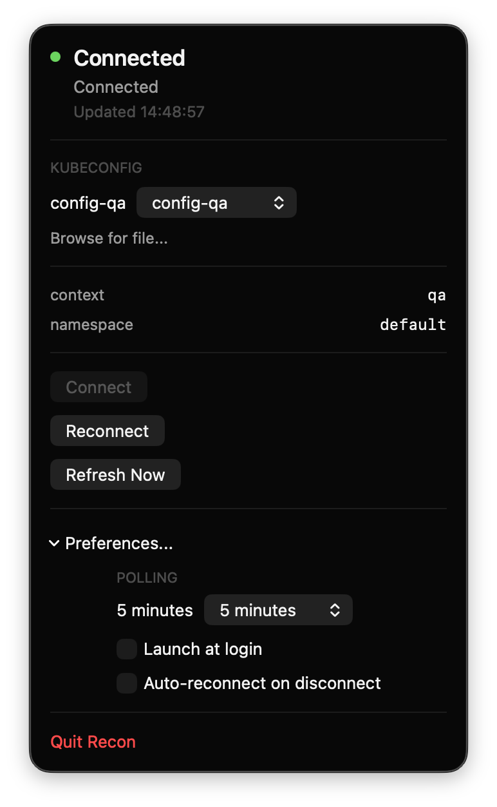

<p align="center">
  
</p>

<h1 align="center">Recon</h1>

<p align="center">
  <em>A macOS menu bar companion for Telepresence.</em>
</p>

<p align="center">
  
  
  
</p>

<p align="center">
  
</p>

Recon is a native macOS menu bar app for people who use Telepresence every day and are tired of babysitting it in Terminal.

It keeps Telepresence visible in the menu bar, shows whether the connection is healthy, and gives you one-click `Connect`, `Reconnect`, and `Refresh Now` actions. It also lets you switch kubeconfig files from the app and automatically reconnects Telepresence with the selected config.

## Why It Exists

Telepresence is great when it works and annoying when it quietly dies, disconnects, or gets stuck on the wrong kubeconfig. Recon turns that into a small native control surface:

- current Telepresence state in the menu bar
- fast reconnect without opening Terminal
- kubeconfig switching from the app
- configurable polling, launch at login, and auto-reconnect
- context, connection, and namespace visibility
- last error shown inline when something fails

## Install

Install the latest release:

```bash
curl -fsSL https://raw.githubusercontent.com/mehmetsecgin/Recon/main/install.sh | bash
```

By default, the installer downloads the latest release and installs `Recon.app` into `~/Applications`.

If you publish the repo under a different owner or repository name, update the URL above or set `RECON_REPO=owner/repo` before running the installer.

## Build From Source

Requirements:

- macOS 14+
- Xcode Command Line Tools
- Telepresence installed locally
- `kubectl` available in your normal shell environment

If you just installed or updated Xcode and `./build.sh` reports an `actool` startup/plugin error, run:

```bash
xcodebuild -runFirstLaunch
```

Recon uses the included `build.sh` script for builds. There is no `Package.swift` or Xcode project to open.

Build:

```bash
./build.sh
```

Run:

```bash
open build/Recon.app
```

## Automatic Releases

This repo includes a GitHub Actions workflow that automatically:

- builds `Recon.app`
- zips it as `Recon.app.zip`
- creates a new GitHub Release when a pull request into `main` is merged

Direct pushes to `main` should be blocked at the repository level, and every change should land through a pull request.

When a pull request into `main` merges, the release workflow cuts a new minor release automatically. If you want the merge to cut a major release instead, add the `release:major` label before merging.

That means the normal path is automatic minor releases on every merged PR, with an explicit label only when you want a major bump.

That keeps the installer pointed at the newest published release without timestamp tags or manual packaging steps.

## Local Release Asset

If you want to build the same release zip locally:

```bash
./release.sh
```

That produces:

- `build/Recon.app`
- `build/Recon.app.zip`

Upload `build/Recon.app.zip` to a GitHub Release. The installer script always pulls the latest release.
If you are using the included GitHub Actions workflow, this upload happens automatically when a pull request is merged into `main`.

## How It Works

- Recon shells out to the installed `telepresence` CLI
- It resolves `KUBECONFIG` and `PATH` from the user environment so Finder-launched app sessions behave like a normal shell session
- Switching kubeconfig files triggers a full Telepresence reconnect
- It polls Telepresence status automatically every 60 seconds by default and also refreshes when you open the menu
- Preferences let users change the polling interval, switch to manual refresh only, enable launch at login, and opt into auto-reconnect
- The app is a menu bar utility, not a full Kubernetes dashboard

## Notes

- Recon is unsigned by default. If you distribute it as a plain zip, macOS may warn users when they open it directly from Finder.
- The provided installer uses `curl` plus a local install into `~/Applications`, which is the smoothest zero-cost distribution path for an unsigned internal tool.
- Launch at login works best when `Recon.app` lives in `~/Applications` or `/Applications`.
